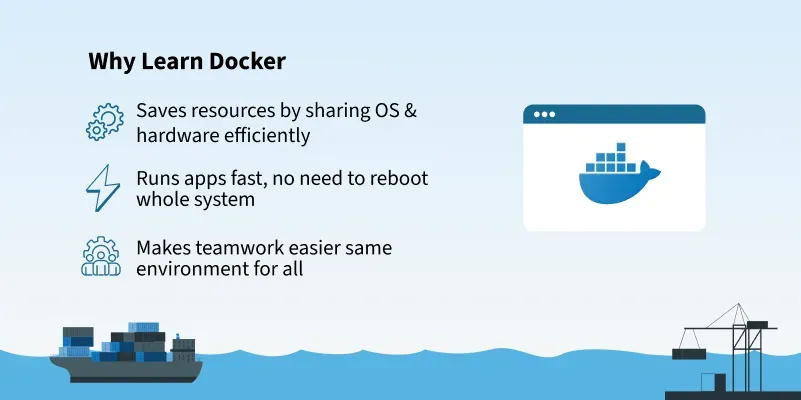

---

# 📦  Docker Basics

Today I completed the foundation of Docker and successfully installed it on my local machine. Below is a full summary of everything I learned and practiced.

---


### 🔹 What is Docker?

Docker is a containerization platform that packages applications and all their dependencies into containers, ensuring consistency across environments.

**Docker**  is a platform that allows you to:

- Package your app and all its dependencies into a lightweight, portable unit called a container.

- Run it anywhere: local machine, cloud, server — without worrying about compatibility.

### 🔹 Containers vs Virtual Machines

| Feature            | Containers                          | Virtual Machines                     |
|--------------------|-------------------------------------|--------------------------------------|
| Boot Time          | Seconds                             | Minutes                              |
| Resource Usage     | Lightweight                         | Heavyweight                          |
| Isolation          | Process-level                       | Full OS-level                        |
| Portability        | Very High                           | Medium                               |
| Performance        | Near-native                         | Overhead due to hypervisor           |

---


## ✅ 3. 🧠 Why Docker Matters in DevOps?

   - Consistency between dev, test, and prod

   - Faster delivery via automation and CI/CD

   - Efficient resource usage

   - Modular architecture (microservices)

---  

## 🛠️ Installation & Setup

### ✅ Installed Docker on Ubuntu

```bash
sudo apt update
sudo apt install docker.io -y
```
### ✅  Start the Docker daemon
```bash
sudo systemctl start docker
```
### Enable Docker to start on boot (recommended)
```bash
sudo systemctl enable docker
```
---
### ✅ Verify that Docker is running

```bash
sudo systemctl status docker
```

### ✅ Checked Docker Version

```bash
docker --version
docker info
```

### ✅ Added my user to Docker group (to run docker without sudo)

```bash
sudo usermod -aG docker $USER
newgrp docker
```

---

## 🐳 Ran First Docker Container

### ✅ Test Docker is working

```bash
docker run hello-world
```

🟢 **Output:**
> Hello from Docker!  
> This confirms Docker is installed and working correctly.

---

## 📅 Pulled and Ran Nginx Container

```bash
docker pull nginx
docker run -d -p 8080:80 nginx
```

### ✅ Verified Nginx Container is Running

```bash
docker ps
```

🟢 Accessed in browser: [http://localhost:8080](http://localhost:8080)

---

## 🧹 Stopped and Removed Container

```bash
docker stop <container_id>
docker rm <container_id>
```

For example:

```bash
docker stop dd42ea9f5669
docker rm dd42ea9f5669
```

---

## 🧠 Bonus Learning

- Created DockerHub account: `ritesh355`
- Understood Docker image lifecycle
- Understood basic Docker architecture:
  - Docker CLI
  - Docker Engine / Daemon
  - Docker Images & Containers
  - DockerHub registry

---

## ✅ 6. 🧰 Docker CLI Basics

| Command                      | Description                   |
| ---------------------------- | ----------------------------- |
| `docker ps`                  | List running containers       |
| `docker ps -a`               | List all containers           |
| `docker images`              | List downloaded images        |
| `docker pull <image>`        | Pull image from Docker Hub    |
| `docker run <image>`         | Run a container from an image |
| `docker stop <container_id>` | Stop a container              |
| `docker rm <container_id>`   | Remove a container            |
| `docker rmi <image_id>`      | Remove an image               |

---

## ✅ Summary

| Task                                   | Status |
|----------------------------------------|--------|
| Install Docker                         | ✅     |
| Run `hello-world` container            | ✅     |
| Pull and run Nginx container           | ✅     |
| Access Nginx via browser               | ✅     |
| Stop and remove container              | ✅     |
| Create DockerHub account               | ✅     |


---

## 🔗 My Work

📂 GitHub Repo: [DevOps Journal](https://github.com/ritesh355/Devops-journal)  
✍️ Blog Post: [Hashnode DevOps Blog](https://ritesh-devops.hashnode.dev)  
🔗 LinkedIn: [Ritesh Singh](https://www.linkedin.com/in/ritesh-singh-092b84340/)


