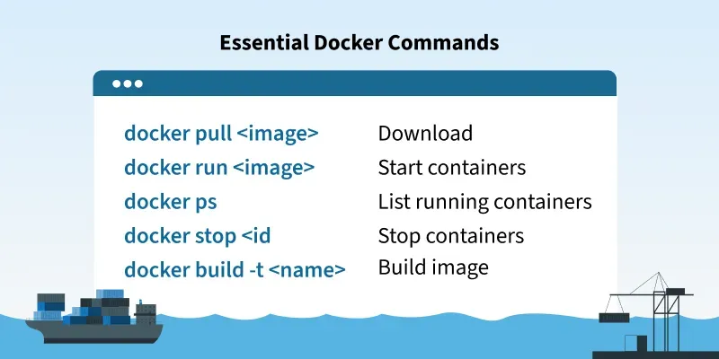

---
#  Docker Basic Commands

 Today, we focused on mastering essential Docker housekeeping commands to manage containers, images, volumes, and perform clean-up tasks effectively.

## 🧠 Concepts Covered
- Listing running and stopped containers
- Removing stopped containers and unused images
- Managing Docker volumes
- Executing commands inside running containers
- Understanding how Docker resources accumulate over time and how to keep your environment clean

## 🔧 Docker Commands Practiced

### CONTAINER
#### 🔍 List Containers
```bash
docker ps              # Lists only running containers
docker ps -a           # Lists all containers (including stopped ones)
```

#### 🧹 Remove Containers
```bash
docker rm <container_id>   # Removes a specific container by ID or name
```
💡 **Tip**: Use `docker ps -a` to find stopped containers you no longer need.

#### Create & Run a New Container
```bash
docker run <image_name>
```
> If the image is not available locally, it’ll be downloaded from Docker Hub.

#### Run Container in Background
```bash
docker run -d <image_name>
```

#### Run Container with Custom Name
```bash
docker run --name <container_name> <image_name>
```

### IMAGES
#### 📦 List Docker Images
```bash
docker images
```

#### 🧽 Remove Docker Images
```bash
docker rmi <image_id>      # Removes an image by its ID
```
💡 **Useful** for deleting old or unused images to free up disk space.

#### Remove Unused Images
```bash
docker image prune
```

#### Build an Image from a Dockerfile
```bash
docker build -t <image_name>:<version> .  # Version is optional
docker build -t <image_name>:<version> . --no-cache  # Build without cache
```

#### Port Binding in Container
```bash
docker run -p<host_port>:<container_port> <image_name>
```

#### Set Environment Variables in a Container
```bash
docker run -e <var_name>=<var_value> <container_name>  # Or <container_id>
```

#### Start or Stop an Existing Container
```bash
docker start|stop <container_name>  # Or <container_id>
```

#### Inspect a Running Container
```bash
docker inspect <container_name>  # Or <container_id>
```

### TROUBLESHOOT
#### Fetch Logs of a Container
```bash
docker logs <container_name>  # Or <container_id>
```

#### Open Shell Inside Running Container
```bash
docker exec -it <container_name> /bin/bash
docker exec -it <container_name> sh
```

### DOCKER HUB
#### Pull an Image from Docker Hub
```bash
docker pull <image_name>
```

#### Publish an Image to Docker Hub
```bash
docker push <username>/<image_name>
```

#### Login to Docker Hub
```bash
docker login -u <image_name>
# Or
docker login
```
> Use `docker logout` to remove credentials.

#### Search for an Image on Docker Hub
```bash
docker search <image_name>
```

### VOLUME
#### 📋 List All Volumes
```bash
docker volume ls
```

#### 🆕 Create a New Named Volume
```bash
docker volume create <volume_name>
```

#### ❌ Delete a Named Volume
```bash
docker volume rm <volume_name>
```

#### 📂 Mounting Volumes
##### 🔗 Mount a Named Volume to a Running Container
```bash
docker run --volume <volume_name>:<mount_path>
# Or using --mount
docker run --mount type=volume,src=<volume_name>,dst=<mount_path>
```

##### ❓ Mount an Anonymous Volume with Running Container
```bash
docker run --volume <mount_path>
```

##### 📎 Create a Bind Mount
```bash
docker run --volume <host_path>:<container_path>
# Or using --mount
docker run --mount type=bind,src=<host_path>,dst=<container_path>
```

#### 🧹 Remove Unused Local Volumes
```bash
docker volume prune
```
📝 **Note**: Use this to remove anonymous volumes that are no longer used.

### 🌐 Docker Networks – Quick Reference
#### 📋 List All Networks
```bash
docker network ls
```

#### 🛠️ Create a Network
```bash
docker network create <network_name>
```

#### ❌ Remove a Network
```bash
docker network rm <network_name>
```

#### Remove All Unused Networks
```bash
docker network prune
```
⚠️ **Warning**: This will remove all unused networks. Ensure no containers depend on them.

## 🔗 Connect with Me
- 💼 [LinkedIn – Ritesh Singh](https://www.linkedin.com/in/ritesh-singh-092b84340/)
- 💻 [GitHub – ritesh355](https://github.com/ritesh355)

