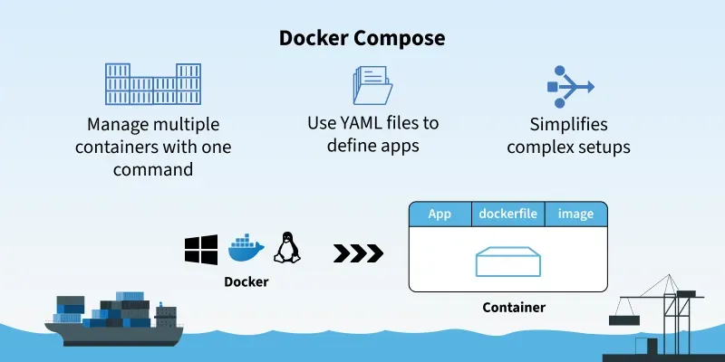

# 🚀 Docker Compose Guide 

 🎉 Docker Compose lets you define and run multi-container applications with ease, streamlining networking, volumes, and service orchestration. This stylish guide provides theory, key commands with **Purpose** and **Detail**, hands-on tasks, and troubleshooting tips to master Docker Compose. It’s tailored for your Flask + Nginx + MongoDB project, building on your Docker volumes and networking skills. Let’s orchestrate like a DevOps rockstar! 🚢

---

## 📚 Theory: Understanding Docker Compose

Docker Compose is a tool for defining and managing multi-container Docker applications using a YAML file (`docker-compose.yml`). It automates container creation, networking, volume mounting, and service dependencies, making it perfect for complex apps like your Flask + Nginx + MongoDB project.

### Purpose

- Simplify multi-container setups by defining services, networks, and volumes in one file.
- Automate container orchestration, reducing manual `docker run` commands.
- Enable consistent environments for development, testing, and production.

### Detail

- **Use Cases**:
  - Running a web app (Flask), reverse proxy (Nginx), and database (MongoDB) together.
  - Managing dependencies (e.g., Flask waits for MongoDB to start).
  - Setting up development environments with live code reloading.
- **Benefits**:
  - **Simplicity**: One file defines all services.
  - **Networking**: Automatically creates a user-defined bridge network for service communication.
  - **Scalability**: Easily scale services or replicate setups.
  - **Portability**: Share `docker-compose.yml` for consistent deployments.
- **Key Components**:
  - **Services**: Containers (e.g., Flask, Nginx, MongoDB).
  - **Networks**: User-defined bridge networks for DNS resolution (like Day 24).
  - **Volumes**: Persistent storage (like Day 23).
- **Relevance to Your Project**: Docker Compose will orchestrate your Flask app, Nginx proxy, and MongoDB database, using volumes for data persistence and networks for communication.

---

## 🛠️ Key Commands

Below are the essential Docker Compose commands, each with a **Purpose** and **Detail** section to clarify their role. These commands are your toolkit for orchestrating multi-container apps! 🔧

### 1. `docker-compose up`

- **Purpose**: Build and start all services defined in `docker-compose.yml`.
- **Detail**:
  - Pulls images, builds custom images (if defined), creates networks/volumes, and starts containers.
  - Use `-d` for detached mode (runs in background).
  - Example:

    ```bash
    docker-compose up -d
    ```
  - **Output**: Shows containers starting (e.g., `Creating app_1 ... done`).
  - **Verification**:

    ```bash
    docker ps
    ```

    Lists running containers (e.g., `app`, `nginx`, `mongo`).

### 2. `docker-compose down`

- **Purpose**: Stop and remove all services, networks, and containers.
- **Detail**:
  - Stops containers and removes them, along with default networks.
  - Preserves volumes unless `--volumes` is added.
  - Example:

    ```bash
    docker-compose down
    ```
  - **Output**: `Stopping app_1 ... done`, `Removing network myapp_default`.
  - **Note**: Add `--volumes` to remove volumes (use cautiously).

### 3. `docker-compose ps`

- **Purpose**: List containers managed by Docker Compose.
- **Detail**:
  - Shows status (running, stopped) of services in the current `docker-compose.yml`.
  - Example:

    ```bash
    docker-compose ps
    ```
  - **Output**:

    ```
    Name                  Command               State         Ports
    app_1                 flask run                Up            5000/tcp
    nginx_1               nginx -g 'daemon off;'   Up            0.0.0.0:80->80/tcp
    mongo_1               docker-entrypoint.sh      Up            27017/tcp
    ```

### 4. `docker-compose logs`

- **Purpose**: View logs from all services.
- **Detail**:
  - Displays logs for debugging or monitoring.
  - Use `-f` to follow logs in real-time.
  - Example:

    ```bash
    docker-compose logs -f
    ```
  - **Output**: Logs from all containers (e.g., Flask app output, Nginx access logs).

### 5. `docker-compose build`

- **Purpose**: Build or rebuild images for services with a `build` directive.
- **Detail**:
  - Builds custom images from Dockerfiles specified in `docker-compose.yml`.
  - Use `--no-cache` for a fresh build.
  - Example:

    ```bash
    docker-compose build
    ```
  - **Output**: Build steps (e.g., `Building app`).

### 6. `docker-compose exec <service> <command>`

- **Purpose**: Run a command in a running service’s container.
- **Detail**:
  - Similar to `docker exec`, but uses service names from `docker-compose.yml`.
  - Example:

    ```bash
    docker-compose exec app bash
    ```
  - **Detail**: Opens a shell in the `app` service’s container.

### 7. `docker-compose stop`

- **Purpose**: Stop all services without removing them.
- **Detail**:
  - Stops containers but keeps them for later restart.
  - Example:

    ```bash
    docker-compose stop
    ```

### 8. `docker-compose start`

- **Purpose**: Start stopped services.
- **Detail**:
  - Restarts containers stopped with `docker-compose stop`.
  - Example:

    ```bash
    docker-compose start
    ```

### 9. `docker-compose rm`

- **Purpose**: Remove stopped containers.
- **Detail**:
  - Deletes containers created by `docker-compose up`.
  - Use `-f` to force removal.
  - Example:

    ```bash
    docker-compose rm -f
    ```

---

## 🧪 Practice: Hands-on Tasks

Let’s apply Docker Compose with tasks that simulate your Flask + Nginx + MongoDB project. These tasks use volumes and networking (from Days 23–24) to create a multi-container app. Each step includes **Purpose**, **Commands**, and **Detail**.

### Task 1: Create a Simple Multi-container App

**Purpose**: Set up a basic Docker Compose app with two services (Nginx and Redis) to learn `docker-compose.yml` basics.

1. **Create Project Directory**:

   - **Purpose**: Set up a directory for the Compose project.
   - **Commands**:

     ```bash
     mkdir ~/compose-demo
     cd ~/compose-demo
     ```
   - **Detail**: Creates `/home/ritesh/compose-demo` for project files.

2. **Create** `docker-compose.yml`:

   - **Purpose**: Define services, networks, and volumes.
   - **Commands**:

     ```bash
     nano docker-compose.yml
     ```

     Paste:

     ```yaml
     version: '3.8'
     services:
       nginx:
         image: nginx:latest
         ports:
           - "8080:80"
         volumes:
           - nginx-data:/usr/share/nginx/html
         networks:
           - my-net
       redis:
         image: redis:alpine
         networks:
           - my-net
     volumes:
       nginx-data:
     networks:
       my-net:
         driver: bridge
     ```

     Save (`Ctrl+O`, `Enter`, `Ctrl+X`).
   - **Detail**:
     - `version: '3.8'`: Specifies Compose file version.
     - `services`: Defines `nginx` and `redis` containers.
     - `ports`: Maps host port 8080 to Nginx’s port 80.
     - `volumes`: Creates a volume `nginx-data` for Nginx’s HTML files.
     - `networks`: Creates a user-defined bridge network `my-net` for DNS resolution.

3. **Start the Services**:

   - **Purpose**: Launch the multi-container app.
   - **Commands**:

     ```bash
     docker-compose up -d
     docker-compose ps
     ```
   - **Detail**:
     - Pulls `nginx` and `redis:alpine`, creates the `nginx-data` volume and `my-net` network, and starts containers.
     - Output:

       ```
       Name                  Command               State         Ports
       compose-demo_nginx_1  nginx -g 'daemon off;'   Up            0.0.0.0:8080->80/tcp
       compose-demo_redis_1  docker-entrypoint.sh     Up            6379/tcp
       ```

4. **Test Nginx**:

   - **Purpose**: Verify Nginx is accessible.
   - **Commands**:

     ```bash
     curl http://localhost:8080
     ```
   - **Detail**: Outputs the Nginx welcome page HTML.
   - **Alternative**: Open `http://localhost:8080` in a browser.

5. **Test Redis Connectivity**:

   - **Purpose**: Confirm DNS resolution between services.
   - **Commands**:

     ```bash
     docker-compose exec nginx bash
     apt-get update && apt-get install -y redis-tools
     redis-cli -h redis ping
     exit
     ```
   - **Detail**:
     - Installs `redis-tools` in the Nginx container.
     - Pings the `redis` service by name (works due to `my-net`).
     - Output: `PONG`

6. **Clean Up**:

   - **Purpose**: Remove resources.
   - **Commands**:

     ```bash
     docker-compose down
     docker volume rm compose-demo_nginx-data
     ```
   - **Detail**: Stops/removes containers and the network. Removes the volume (optional).

**Key Takeaway**: Docker Compose simplifies multi-container setups with a single YAML file, using volumes and networks.

### Task 2: Simulate Flask + MongoDB App

**Purpose**: Build a simplified version of your Flask + MongoDB project with Docker Compose, using volumes and networking.

1. **Create Project Directory**:

   - **Purpose**: Set up a directory for the Flask + MongoDB app.
   - **Commands**:

     ```bash
     mkdir ~/flask-mongo
     cd ~/flask-mongo
     mkdir app
     ```
   - **Detail**: Creates `/home/ritesh/flask-mongo` and an `app` folder for Flask code.

2. **Create Flask App**:

   - **Purpose**: Build a simple Flask app to connect to MongoDB.
   - **Commands**:

     ```bash
     nano app/app.py
     ```

     Paste:

     ```python
     from flask import Flask
     from pymongo import MongoClient
     
     app = Flask(__name__)
     
     @app.route('/')
     def index():
         client = MongoClient('mongodb://mongo:27017/')
         db = client['mydb']
         db['mycollection'].insert_one({'message': 'Hello, Docker Compose!'})
         return 'Data inserted into MongoDB!'
     
     if __name__ == '__main__':
         app.run(host='0.0.0.0', port=5000)
     ```

     Save.

     ```bash
     nano app/requirements.txt
     ```

     Paste:

     ```
     flask==2.0.1
     pymongo==4.0.1
     ```

     Save.
   - **Detail**: Creates a Flask app that inserts data into MongoDB and a `requirements.txt` for dependencies.

3. **Create Dockerfile for Flask**:

   - **Purpose**: Define a custom image for the Flask app.
   - **Commands**:

     ```bash
     nano Dockerfile
     ```

     Paste:

     ```dockerfile
     FROM python:3.9-slim
     WORKDIR /app
     COPY app/requirements.txt .
     RUN pip install --no-cache-dir -r requirements.txt
     COPY app/ .
     CMD ["flask", "run", "--host=0.0.0.0"]
     ```

     Save.
   - **Detail**: Builds a Python image, installs dependencies, and runs the Flask app.

4. **Create** `docker-compose.yml`:

   - **Purpose**: Define Flask and MongoDB services with volumes and networking.
   - **Commands**:

     ```bash
     nano docker-compose.yml
     ```

     Paste:

     ```yaml
     version: '3.8'
     services:
       app:
         build: .
         ports:
           - "5000:5000"
         volumes:
           - ./app:/app
         networks:
           - app-net
         depends_on:
           - mongo
       mongo:
         image: mongo:latest
         volumes:
           - mongo-data:/data/db
         networks:
           - app-net
     volumes:
       mongo-data:
     networks:
       app-net:
         driver: bridge
     ```

     Save.
   - **Detail**:
     - `app`: Builds from the `Dockerfile`, maps port 5000, mounts `./app` as a bind mount for development, connects to `app-net`.
     - `mongo`: Uses `mongo:latest`, mounts `mongo-data` volume for persistence, connects to `app-net`.
     - `depends_on`: Ensures MongoDB starts before Flask.

5. **Start the Services**:

   - **Purpose**: Launch the Flask + MongoDB app.
   - **Commands**:

     ```bash
     docker-compose up -d
     docker-compose ps
     ```
   - **Detail**:
     - Builds the Flask image, pulls `mongo:latest`, and starts containers.
     - Output:

       ```
       Name                  Command               State         Ports
       flask-mongo_app_1    flask run --host=0.0.0.0 Up            0.0.0.0:5000->5000/tcp
       flask-mongo_mongo_1  docker-entrypoint.sh      Up            27017/tcp
       ```

6. **Test the App**:

   - **Purpose**: Verify Flask connects to MongoDB.
   - **Commands**:

     ```bash
     curl http://localhost:5000
     ```
   - **Detail**:
     - Output: `Data inserted into MongoDB!`
     - **Alternative**: Open `http://localhost:5000` in a browser.

7. **Verify MongoDB Data**:

   - **Purpose**: Confirm data persistence in MongoDB.
   - **Commands**:

     ```bash
     docker-compose exec mongo mongosh mydb
     ```

     Inside:

     ```javascript
     db.mycollection.find()
     ```

     Output: `{ "_id": ..., "message": "Hello, Docker Compose!" }`Exit: `exit`
   - **Detail**: Checks the inserted document in MongoDB.

8. **Test Persistence**:

   - **Purpose**: Ensure MongoDB data persists.
   - **Commands**:

     ```bash
     docker-compose down
     docker-compose up -d
     docker-compose exec mongo mongosh mydb
     db.mycollection.find()
     ```
   - **Detail**: Stops/removes containers, restarts, and confirms data persists.

9. **Clean Up**:

   - **Purpose**: Remove resources.
   - **Commands**:

     ```bash
     docker-compose down --volumes
     ```
   - **Detail**: Removes containers, networks, and the `mongo-data` volume.

**Key Takeaway**: Docker Compose orchestrates your Flask + MongoDB app, using volumes for persistence and networks for communication.

---

## 🔍 Troubleshooting Tips

- **Container Exits Immediately** 🚨:

  - **Issue**: Flask or other containers exit (like your Ubuntu issue).
  - **Fix**: Ensure correct `CMD` in Dockerfile or `command` in `docker-compose.yml`.

    ```yaml
    command: flask run --host=0.0.0.0
    ```
  - **Verify**: `docker-compose ps`.

- **Bind Mount Error** ⚠️:

  - **Issue**: “invalid characters” (your previous issue).
  - **Fix**: Use correct paths in `volumes`:

    ```yaml
    volumes:
      - ./app:/app
    ```

- **MongoDB Connection Failure** 🔗:

  - **Issue**: Flask can’t connect to `mongo`.
  - **Fix**: Use service name (`mongo`) in the connection string and ensure `depends_on` and `networks` match.
  - **Verify**:

    ```bash
    docker-compose logs app
    ```

- **Permission Issues** 🔒:

  - **Fix**: Adjust bind mount permissions:

    ```bash
    chmod -R 777 ~/flask-mongo/app
    ```

    **Warning**: Avoid `777` in production.

- **Port Conflicts** 🛑:

  - **Issue**: Port 5000 or 8080 already in use.
  - **Fix**: Check and free ports:

    ```bash
    sudo netstat -tulnp | grep 5000
    sudo kill <pid>
    ```

---

## 🌟 Additional Notes

- **Docker Compose vs. Docker Run**:
  - Compose automates multi-container setups, reducing manual commands.
  - Ideal for your Flask + Nginx + MongoDB project.
- **Project Relevance**: This setup mirrors your Day 31–33 project, where you’ll add Nginx as a reverse proxy.
- **Resources**:
  - Docker Compose Docs
  - Compose File Reference

---

## 🚀 Extended Practice (Optional)

1. **Add Nginx to Task 2**:

   - **Purpose**: Simulate your full project with Nginx as a reverse proxy.
   - **Commands**:

     ```bash
     mkdir nginx
     nano nginx/default.conf
     ```

     Paste:

     ```
     server {
         listen 80;
         location / {
             proxy_pass http://app:5000;
             proxy_set_header Host $host;
             proxy_set_header X-Real-IP $remote_addr;
         }
     }
     ```

     Update `docker-compose.yml`:

     ```yaml
     version: '3.8'
     services:
       app:
         build: .
         volumes:
           - ./app:/app
         networks:
           - app-net
         depends_on:
           - mongo
       mongo:
         image: mongo:latest
         volumes:
           - mongo-data:/data/db
         networks:
           - app-net
       nginx:
         image: nginx:latest
         ports:
           - "80:80"
         volumes:
           - ./nginx/default.conf:/etc/nginx/conf.d/default.conf
         networks:
           - app-net
         depends_on:
           - app
     volumes:
       mongo-data:
     networks:
       app-net:
         driver: bridge
     ```

     Run:

     ```bash
     docker-compose up -d
     curl http://localhost
     ```

2. **Scale Services**:

   - **Purpose**: Test scaling with Compose.
   - **Commands**:

     ```bash
     docker-compose up -d --scale app=2
     ```
   - **Detail**: Runs two Flask instances.

---

